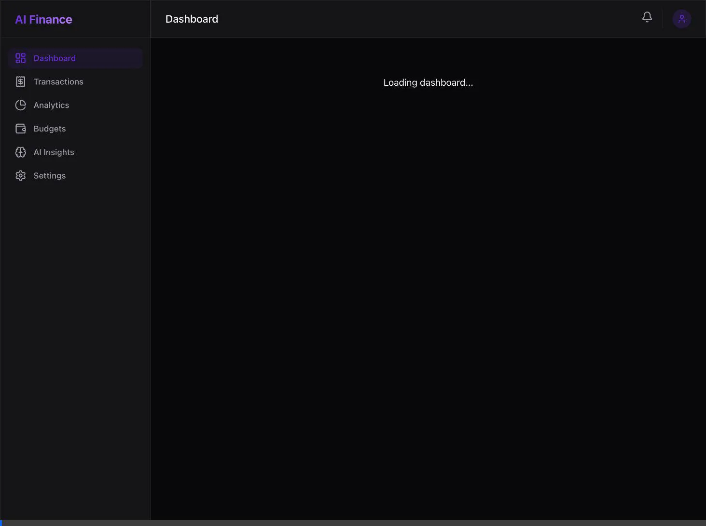

# AI Personal Finance Dashboard

Welcome to the AI Personal Finance Dashboard! This is a modern, full-stack web application designed to help users track expenses, manage category budgets, and receive intelligent financial insights using an AI assistant.

This project is built using a powerful modern technology stack:
- **Frontend:** Next.js (App Router), React, Tailwind CSS, Recharts
- **Backend:** FastAPI, SQLAlchemy, Pydantic, g4f (AI Integration)
- **Database:** SQLite (Configured for easy local development, completely structure-ready for PostgreSQL)

## Features

- 🔐 **JWT Authentication:** Secure user registration and login system.
- 💳 **Expense & Income Tracking:** Full CRUD capability for transactions.
- 📊 **Dynamic Dashboards:** Interactive charts mapping your spending habits using Recharts.
- 🎯 **Budget System:** Set monthly limits on spending categories with visual progress bars.
- 🔔 **Intelligent Notifications:** Real-time alerts when you exceed your set budget.
- 🤖 **AI Financial Advisor:** Powered by `g4f`, get natural language summaries and actionable advice on your monthly spending.
- 📈 **Algorithmic Forecasting:** Pandas-driven linear forecasting predicting your next month's total expenses.
- 📁 **CSV Import:** Easily bulk import historical transactions.
- 📱 **Mobile Responsive:** Clean, glassmorphism UI that adapts seamlessly to mobile devices.

---

## Live Demonstration



---

## Getting Started

This repository contains two main folders: `backend` and `frontend`. You will need to run both servers simultaneously to use the application.

### 1. Starting the Backend (FastAPI)

First, set up and run the backend API server.

```bash
# Navigate to the backend directory
cd backend

# Create a Python virtual environment (if you haven't already)
python3 -m venv venv

# Activate the virtual environment
source venv/bin/activate  # On macOS/Linux
# .\venv\Scripts\activate # On Windows

# Install all dependencies
pip install -r requirements.txt
# (Note: if requirements.txt isn't present, run: pip install fastapi uvicorn sqlalchemy "passlib[bcrypt]" "python-jose[cryptography]" python-multipart pydantic pydantic-settings python-dotenv "pydantic[email]" g4f pandas)

# Start the FastAPI server
uvicorn app.main:app --reload --port 8002
```

The backend server is now running. You can view the interactive API documentation (Swagger UI) at:
👉 **http://localhost:8002/docs**

### 2. Starting the Frontend (Next.js)

Open a **new terminal window**, and start the Next.js frontend application.

```bash
# Navigate to the frontend directory
cd frontend

# Install Node.js dependencies
npm install

# Start the development server
npm run dev
```

The frontend application is now running. Open your browser and navigate to:
👉 **http://localhost:3002**

*(Note: Depending on port availability, Next.js may launch on port 3000, 3001, or 3002. Check your terminal output!)*

---

## Demonstration & Testing

To fully test the application capabilities, follow these steps:

1. **Register:** Create a new account at `http://localhost:3002/register`.
2. **Add Transactions:** Go to the **Transactions** tab and add a few test transactions (e.g., $100 for Food, $2000 Income for Salary).
3. **CSV Import:** Alternatively, you can click "Import CSV" and upload a `.csv` file with headers: `amount`, `type`, `category`, `date`.
4. **Set Budgets:** Go to the **Budgets** tab and set a $50 limit for "Food".
5. **Trigger Notification:** Add another $20 "Food" expense. Check the Bell icon in the top right to see your automatic budget overflow alert.
6. **AI Insights:** Go to the **AI Insights** tab and click "Generate AI Summary". Wait a few seconds for the g4f model to analyze your data and return a personalized tip!
